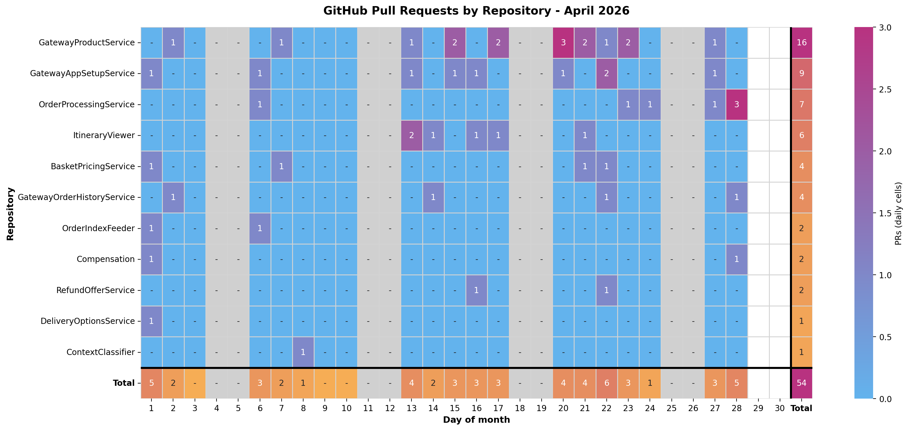
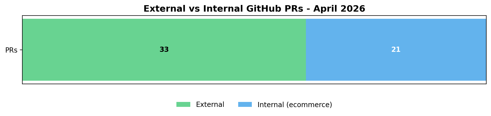

# Support Stats

This workflow extracts data from GitHub and Jira to generate visualisations and produce insights on PRs.  
Recommended: prepare required [user inputs](#capability-1-github-minimal-repo-discovery) for each capability beforehand

## Sample Charts

### PR Heatmap



### Internal vs External PRs



## Quick Start (Recommended)

Use the full workflow entrypoint:

```bash
python3 scripts/run-workflow.py
python3 scripts/run-workflow.py --month 2026-04
```

This runs setup, fetches GitHub and Jira data, generates charts, and writes a markdown report.

## Requirements

Some dependencies can be detected and guided by the scripts, but a few account-specific values must be provided by the user.

Technical dependencies:

- Python 3.9+
- GitHub CLI (`gh`) installed
- `gh` authenticated to the right org
- Python packages from `requirements.txt`

Install examples:

```bash
brew install gh
python3 -m pip install -r requirements.txt
gh auth login
```

## Required User Inputs By Capability

Setup is capability-based. The workflow runs all capabilities by default.

### Capability 1: GitHub minimal (repo discovery)

User must provide:

- GitHub org (for example `trainline-private`)
- Owner slug(s) from `catalog-info.yaml` (`spec.owner`), comma-separated if multiple, for example `ecommerce,checkout`

Used for:

- Discovering owned repositories for PR data collection

### Capability 2: GitHub internal team

User must provide:

- Either comma-separated GitHub usernames for internal members
- Or team mappings for per-team split (for example `Ecommerce:davdieievttl,dbaliuk;Checkout:alice,bob`)

Used for:

- Internal team vs external PR split chart (with optional per-team internal segments)

### Capability 3: Jira minimal

User must provide:

- Jira site (defaults to `trainline.atlassian.net`)
- Jira email
- Jira project key (for example `ECOM`)
- Vertical Support issue types (default prompt includes `PR Request,ExternalRequest`)
- Optional Vertical Support Jira labels/tags (for example `vertical support`)
- Jira API token generated specifically for this workflow

Token creation link:

- https://id.atlassian.com/manage-profile/security/api-tokens

Notes:

- Credentials are stored via `keyring` (native OS credential store).
- If stored Jira credentials fail auth, setup clears them and re-prompts.

### Capability 4: Jira org structure (enhanced team heatmap)

User may need to provide (defaults are prefilled):

- Source repo owner/name/path/ref for org structure JSON
- Optional Jira requesting-team field IDs

Used for:

- Team normalization and requesting-team heatmap enrichment

## Main Commands

Full workflow (preferred):

```bash
python3 scripts/run-workflow.py --month 2026-04
python3 scripts/run-workflow.py --skip-setup --month 2026-04
```

Setup only:

```bash
python3 scripts/setup.py
python3 scripts/setup.py --list
python3 scripts/setup.py --capabilities 1,2,3,4
python3 scripts/setup.py --capabilities 2 --internal-teams "Ecommerce:user1,user2;Checkout:user3"
```

Fetch only:

```bash
python3 scripts/fetch-data.py github --month 2026-04
python3 scripts/fetch-data.py jira --month 2026-04
```

Generate only:

```bash
python3 scripts/generate-charts.py --month 2026-04
python3 scripts/generate-report.py --month 2026-04
```

Clean generated data:

```bash
python3 scripts/clean.py --cache
python3 scripts/clean.py --reports
python3 scripts/clean.py --config
python3 scripts/clean.py --cache --reports --archive --yes
python3 scripts/clean.py --all --archive --yes
```

## Outputs

- `config/owned-repositories.json`
- `config/github-minimal.json`
- `config/github-internal-team.json`
- `config/jira-minimal.json`
- `config/jira-org-structure.json`
- `config/jira-metric-groups.json`
- `config/capabilities.json`
- `cache/github/prs-YYYY-MM.json`
- `cache/jira/issues-YYYY-MM.json`
- `reports/github_pr_heatmap_YYYY_MM.png`
- `reports/github_pr_internal_external_YYYY_MM.png`
- `reports/jira_service_heatmap_YYYY_MM.png`
- `reports/jira_requesting_team_heatmap_YYYY_MM.png`
- `reports/report_YYYY_MM.md`
- `archives/pre-clean/YYYYMMDDTHHMMSSZ/`

## Notes

- Hand-maintained files such as `config/jira-team-normalization.json` and `config/jira-team-overrides.json` are intentionally not removed by config clean.
- Existing `data/config/*` files are still read as fallback for migration compatibility.
- Jira fetch always pulls all issues for the configured project/month window. Vertical Support is defined in `config/jira-minimal.json` and can be filtered by issue type and/or Jira labels (tags) during processing.
- Cycle-time grouping and deterministic window/validity rules are configured in `config/jira-metric-groups.json`.
